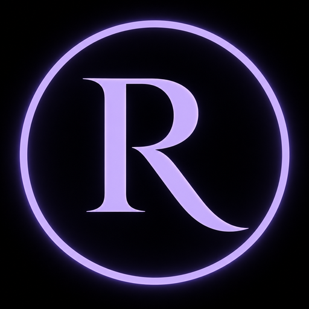
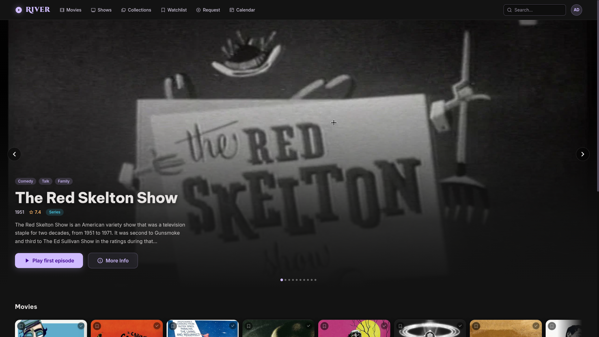
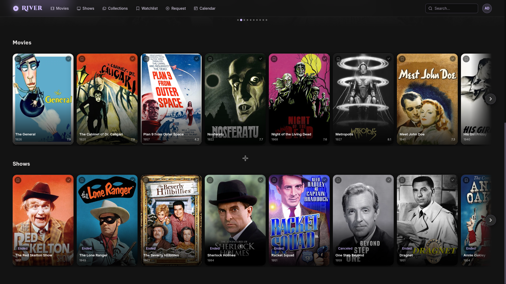
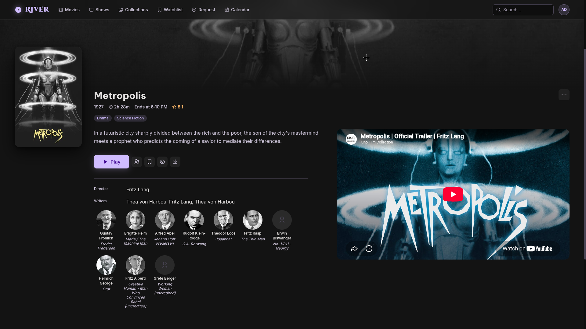
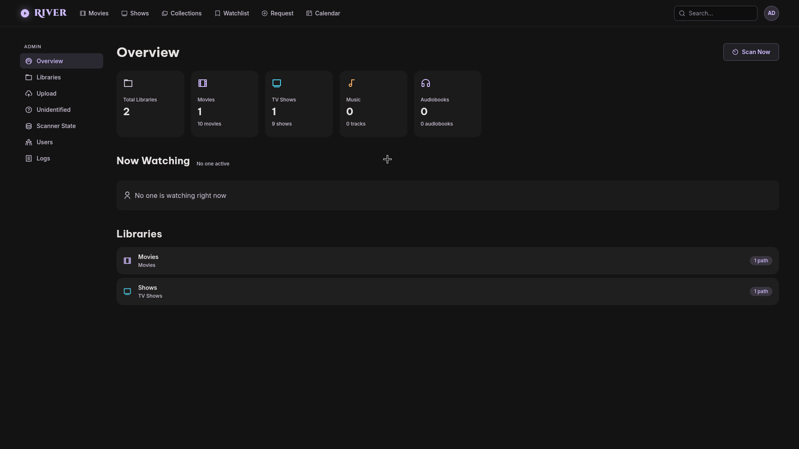
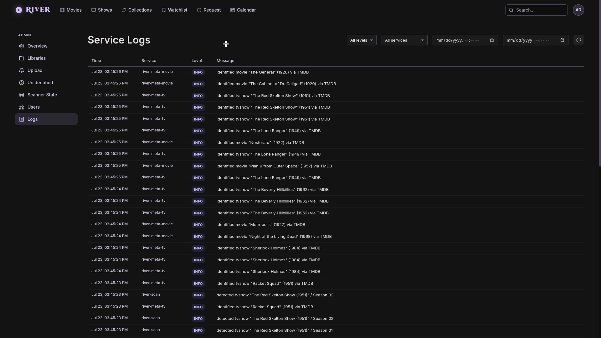

# River



Self-hosted media platform. Movies, TV shows, music, and audiobooks — scanned from disk, transcoded to browser-friendly formats, enriched with metadata, streamed to a web browser or a TV app.

## Features

**Media library**
- Four media types, end to end: **movies**, **TV shows** (seasons + episodes), **music** (artists / albums / tracks), and **audiobooks** (with chapters).
- Automatic filesystem scanning with incremental rescans — a size + mod-time hash short-circuits unchanged files — and `SxxExx` season/episode parsing.
- Metadata enrichment from **TMDB** (movies + TV), **Open Library** (audiobooks), and **MusicBrainz** + **Cover Art Archive** + **Wikipedia** (music) — posters, backdrops, descriptions, cast/crew, ratings, and genres.
- Pre-transcoded libraries can skip the transcode step and stream as-is.

**Playback & streaming**
- Media is transcoded once at ingestion to browser-friendly **H.264 / AAC / MP4** (video) and **AAC / M4A** (audio), capped at 1080p — playback streams the pre-transcoded files directly, no per-request transcoding.
- Optional **NVENC GPU acceleration** with automatic fallback to CPU (`libx264`).
- **HTTP Range** streaming for instant seeking, plus **WebVTT subtitle** extraction and **multiple audio tracks**.
- **Continue watching**, per-title watch progress, "next up" suggestions, and optional file **downloads**.
- **Watch party** — real-time synchronized playback across viewers over WebSockets.

**Discovery**
- Home page with hero banner, continue-watching, and recently-added rows.
- Browse grids per library, global search, cast/crew credits, and "similar titles".
- User **collections** and **watchlist**.

**Requests — Radarr & Sonarr integration**
- Search **Radarr** (movies) and **Sonarr** (TV) for titles you don't own yet, right from the web client.
- Request a title and River adds it to Radarr/Sonarr for you — root folder and quality profile are auto-selected from each server's defaults, so there's nothing to configure per request.
- A combined **calendar** merges upcoming and recently-released dates from both Radarr and Sonarr into one upcoming-releases view.
- Fully optional: point River at your `*arr` instances with URL + API key, or leave it off (request endpoints simply report unavailable when unconfigured).

**Clients**
- **`river-web`** — full browser client and admin surface.
- **`river-tv`** — TV-optimized client with D-pad / spatial focus navigation.
- **`river-tv-android`** — Android TV / Fire TV launcher app wrapping the TV client.

**Accounts & administration**
- JWT auth with rotating refresh tokens; the first registered user becomes **admin**.
- Admin dashboard: library stats, library management, media upload, unidentified items, scanner state, users, active sessions, and service logs.

**Platform**
- Eight independent Go microservices, decoupled via **RabbitMQ**.
- One-command **Docker Compose** deployment (with an opt-in NVIDIA GPU overlay) and env-based configuration.
- **Swagger / OpenAPI** docs, paginated list endpoints, and an image proxy for CDN artwork.

## Screenshots

| | |
|---|---|
|  |  |
| Home page — hero banner and content rows | Browse — poster grid across libraries |
|  |  |
| Detail page — synopsis, cast, and trailer | Admin — library stats and overview |



*Service logs — metadata enrichment identifying titles via TMDB.*

## Architecture at a glance

```
Filesystem
    └─→ [river-scan] ──→ RabbitMQ (river.media topic exchange)
                              ├─→ [river-video-trans]  H.264/AAC/MP4 (+NVENC opt.)
                              ├─→ [river-audio-trans]  AAC .m4a
                              ├─→ [river-meta-movie]   TMDB enrichment
                              ├─→ [river-meta-tv]      TMDB enrichment (seasons/eps)
                              ├─→ [river-meta-book]    Open Library
                              └─→ [river-meta-music]   MusicBrainz

              [river-api]  ← records ← every producer above
                    ↓
    ┌──────────────┼──────────────────┐
[river-web]   [river-tv]      [river-tv-android]
 (browser)     (Vite web)       (Fire/Android TV)
```

- **`river-api`** owns Postgres + auth + streaming. Every other backend service is an HTTP client to it.
- **RabbitMQ** is the only inter-service coupling on the ingest side. Every downstream consumer listens for `media.discovered.*` events and works independently.
- **Client apps** all talk to `river-api` and are otherwise independent.

## Repo layout

**Backend services** (Go, one module each):

| Service | Role |
|---|---|
| [`river-api`](./river-api/) | Central REST API (Gin + GORM + Postgres). Auth, media CRUD, streaming, image proxy. |
| [`river-scan`](./river-scan/) | Filesystem walker. Publishes discovery events to RabbitMQ. |
| [`river-video-trans`](./river-video-trans/) | Transcodes movies + TV episodes. NVENC where available, libx264 fallback. |
| [`river-audio-trans`](./river-audio-trans/) | Transcodes music + audiobooks to AAC/M4A. |
| [`river-meta-movie`](./river-meta-movie/) | TMDB enrichment for movies. |
| [`river-meta-tv`](./river-meta-tv/) | TMDB enrichment for shows / seasons / episodes. |
| [`river-meta-book`](./river-meta-book/) | Open Library enrichment for audiobooks. |
| [`river-meta-music`](./river-meta-music/) | MusicBrainz enrichment for music. |

**Client apps**:

| Client | Stack |
|---|---|
| [`river-web`](./river-web/) | Browser client — React + Vite. Also serves as the admin surface. |
| [`river-tv`](./river-tv/) | TV-optimised web app — React + Vite. D-pad focus navigation. |
| [`river-tv-android`](./river-tv-android/) | Android TV / Fire TV launcher app — WebView-wraps the `river-tv` build. |

## Running it

The whole backend runs from Docker Compose. GPU (NVENC) is opt-in.

```bash
cp .env.example .env
# Edit .env — set POSTGRES_PASSWORD, JWT_SECRET, ADMIN_PASSWORD, TMDB_API_KEY,
# MEDIA_PATH (host path with your files), OUTPUT_PATH (transcoder output root).

docker compose up -d                        # CPU-only
docker compose -f docker-compose.yml \
               -f docker-compose.gpu.yml up -d   # with NVENC on nvidia GPU
```

First boot registers an admin user (username / password from `.env`).

**Client apps are built and deployed separately** — see each client's own README.

## Documentation

Each service directory has a `CLAUDE.md` (originally written to guide Claude Code) that doubles as authoritative architecture reference — layer boundaries, patterns, tradeoffs. Start there when working on that specific service.

## Environment variables

Full list of required and optional env vars lives in [`.env.example`](./.env.example). Each service also documents its own subset in its README.

## License

River is licensed under the [GNU Affero General Public License v3.0](./LICENSE) (AGPL-3.0).
